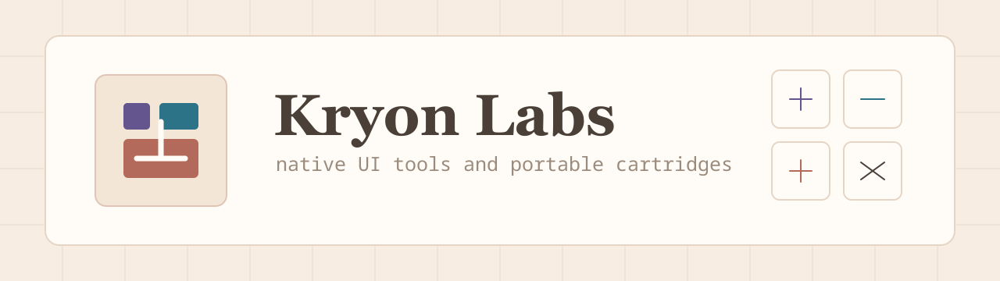

 

# Kryon Labs

**Native-first tools for small, portable software.**

Kryon Labs builds the Kryon runtime, editor, and sync tools around a simple
principle: readable source, direct primitives, portable builds, and project
structure that stays easy to inspect.

[kryonlabs.com](https://kryonlabs.com) | [github.com/kryonlabs](https://github.com/kryonlabs) | [x.com/kryonlabs](https://x.com/kryonlabs)

## What We Build

| Project | Focus |
| --- | --- |
| [Kryon](https://github.com/kryonlabs/kryon) | C runtime, UI toolkit, `.kry` language tools, native builds, and portable KRB cartridges. |
| [Krait](https://github.com/kryonlabs/krait) | Standalone IDE for editing, previewing, and building Kryon projects. |
| [Ksync](https://github.com/kryonlabs/ksync) | Stateless sync relay for Kryon apps, account keys, mirrored app data, and social APIs. |

## Principles

- Native C remains first-class.
- Generated code stays readable and debuggable.
- UI primitives stay small enough to understand and compose.
- Apps should move across desktop, mobile, web, and cartridge-style runtimes.
- Automation should work with the project structure, not around it.

## Start Here

- Use [Kryon](https://github.com/kryonlabs/kryon) for the runtime, toolkit, and language tools.
- Use [Krait](https://github.com/kryonlabs/krait) when you want the IDE workflow.
- Use [Ksync](https://github.com/kryonlabs/ksync) when a Kryon app needs account-backed sync.
